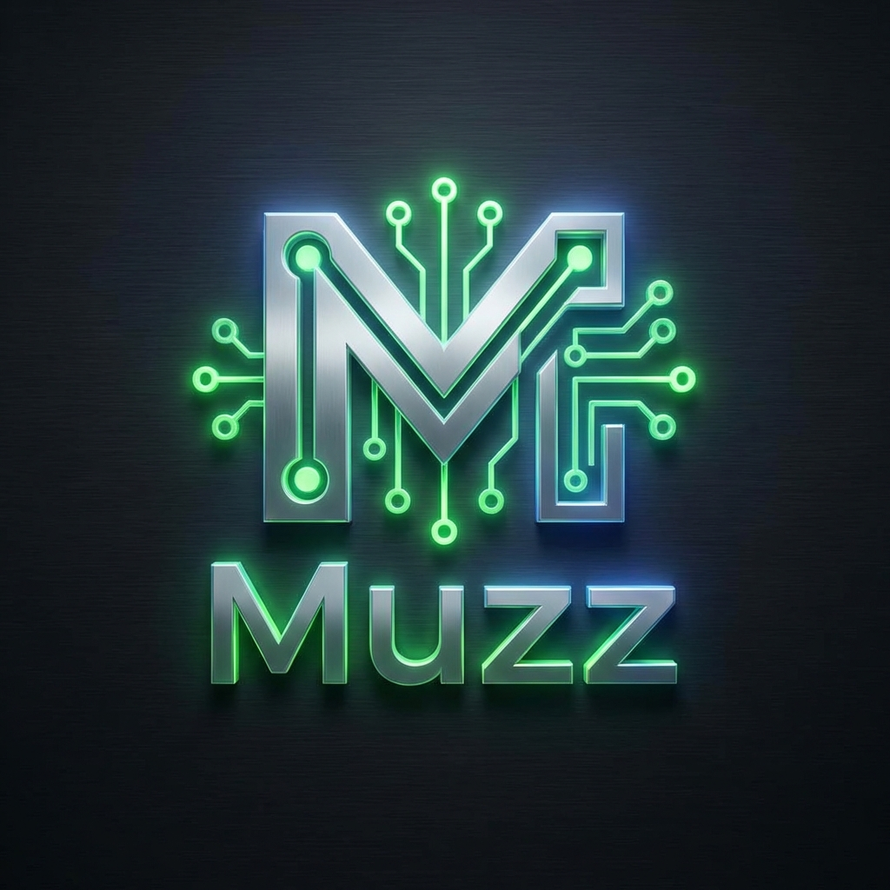

# 🤖 Muzz - The Ultimate AI WhatsApp Companion

<div align="center">
  

  <br />
  <br />

  [](https://python.org)
  [](https://fastapi.tiangolo.com)
  [](https://langchain.com)
  [](https://docker.com)
  [](https://supabase.com)
  [](https://qdrant.tech)
  [](https://developers.facebook.com/docs/whatsapp)

  <br />

  **Build a fully autonomous, multi-modal AI agent for WhatsApp.**  
  *Voice. Vision. Memory. Schedule Awareness.*
</div>

---

## 📖 About The Project

**Muzz** is a state-of-the-art AI agent designed to live where you chat—WhatsApp. Unlike standard chatbots, Muzz maintains a persistent identity, remembers past conversations indefinitely, and understands the world through multiple modalities.

It is built on a sophisticated **LangGraph** architecture, allowing for complex decision-making, tool usage, and autonomous state management.

### ✨ Core Capabilities

*   **🗣️ Human-Like Voice**: Speaks back with ultra-realistic ElevenLabs voices.
*   **👁️ Computer Vision**: Shows it a photo, and it analyzes it in real-time.
*   **🧠 Infinite Memory**: Uses Qdrant vector storage to "remember" facts about you forever.
*   **⏰ Identity & Time**: Aware of its own schedule, time of day, and routine.
*   **🎨 Creative Studio**: Generates AI images on demand.

---

## 🏗️ Architecture Stack

This project uses a production-grade tech stack suitable for scaling:

| Layer | Technology | Purpose |
| :--- | :--- | :--- |
| **Agentic Core** | **LangGraph** | Orchestrates the "Choice-of-Thought" reasoning loop. |
| **LLM Inference** | **Llama 3.3 (via Groq)** | Provides near-instant intelligence. |
| **API Interface** | **FastAPI** | High-performance async webhook handler. |
| **Knowledge Base** | **Qdrant (Vector)** | Retrieval-Augmented Generation (RAG) for memory. |
| **Data Persistence** | **Supabase (SQL)** | Structured logs, user sessions, and analytics. |
| **Voice Engine** | **ElevenLabs / Whisper** | Best-in-class TTS and STT models. |

---

## 🚀 Getting Started

Follow these steps to deploy your own Muzz instance.

### Prerequisites

*   **Docker Desktop** installed.
*   **Python 3.12+** (optional, for local dev).
*   API Keys for **Groq**, **ElevenLabs**, **Qdrant**, and **Meta/WhatsApp**.

### 1. Clone & Setup

```bash
git clone https://github.com/your-username/muzz-ai-agent.git
cd muzz-ai-agent
cp .env.example .env
```

> **Note**: Fill in your API keys in the `.env` file.

### 2. Launch with Docker

The easiest way to run Muzz is using Docker Compose. This spins up the WhatsApp webhook endpoint and the Chainlit debugging UI.

```bash
docker-compose up -d --build
```

### 3. Connect WhatsApp

1.  Start a tunnel to your local machine (using ngrok):
    ```bash
    docker-compose -f docker-compose.ngrok.yml up -d
    ```
    *Or run manually:* `ngrok http 8080`
2.  Copy your HTTPS forwarding URL.
3.  Go to the **Meta Developers Portal** -> **WhatsApp** -> **Configuration**.
4.  Paste the URL into the **Callback URL** field (append `/webhook`), e.g., `https://your-url.ngrok-free.app/webhook`.
5.  Verify the token using the `WHATSAPP_VERIFY_TOKEN` from your `.env`.

---

## 🖥️ Usage

### 🕵️ Developer UI (Chainlit)
Visit `http://localhost:8000` to interact with Muzz's brain directly.
*   Visualize the graph execution.
*   See tool calls and memory retrieval in real-time.

### 📱 WhatsApp Interface
Send messages to your test number:
*   **Voice Notes**: Muzz listens and replies with audio.
*   **Images**: "What do you think of this outfit?"
*   **Text**: General chat and assistance.

---

## 📂 Project Structure

A clean, modular structure designed for maintainability.

```text
├── src/
│   └── ai_companion/
│       ├── core/           # ⚙️ Config & Prompts
│       ├── graph/          # 🧠 Brain Logic (Nodes & Edges)
│       ├── interfaces/     # 🔌 WhatsApp & Chainlit Connectors
│       └── modules/        # 🛠️ Tools (Vision, Memory, Speech)
├── Dockerfile              # 🐳 Production Image
├── docker-compose.yml      # 🐙 Orchestration
└── pyproject.toml          # 📦 Dependencies (managed by UV)
```

---

## 🤝 Contributing

Contributions are welcome! Please feel free to submit a Pull Request.

---

